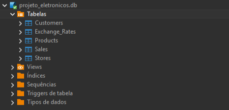
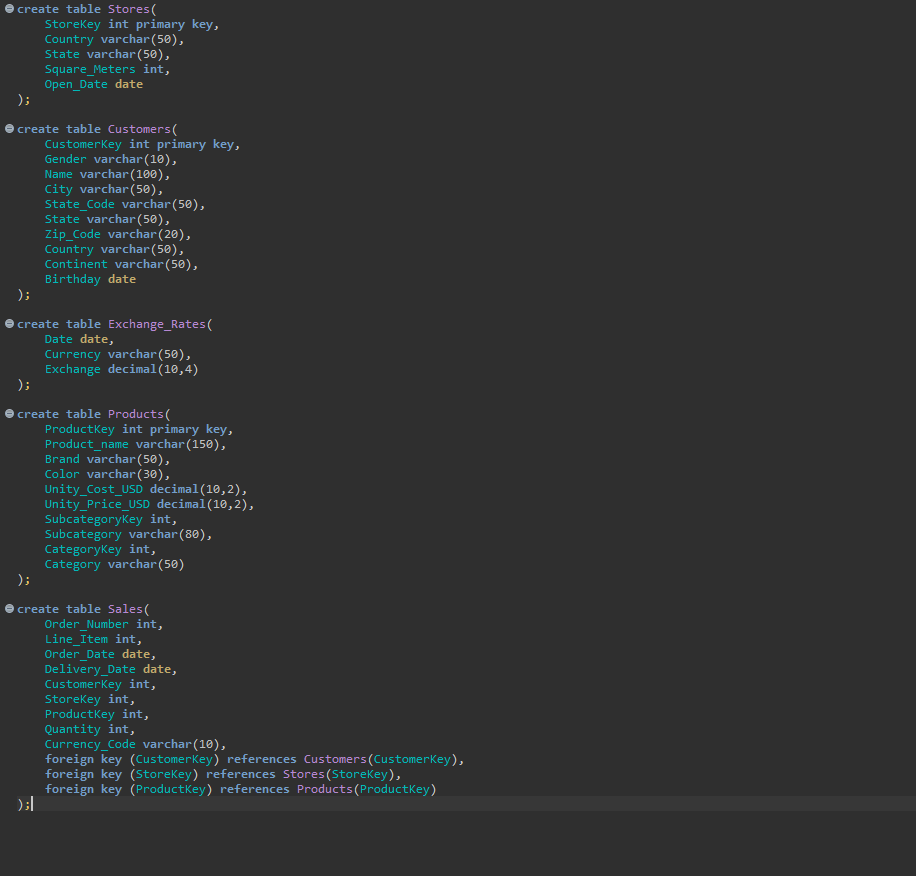
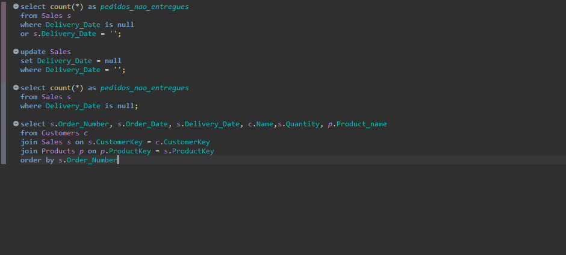
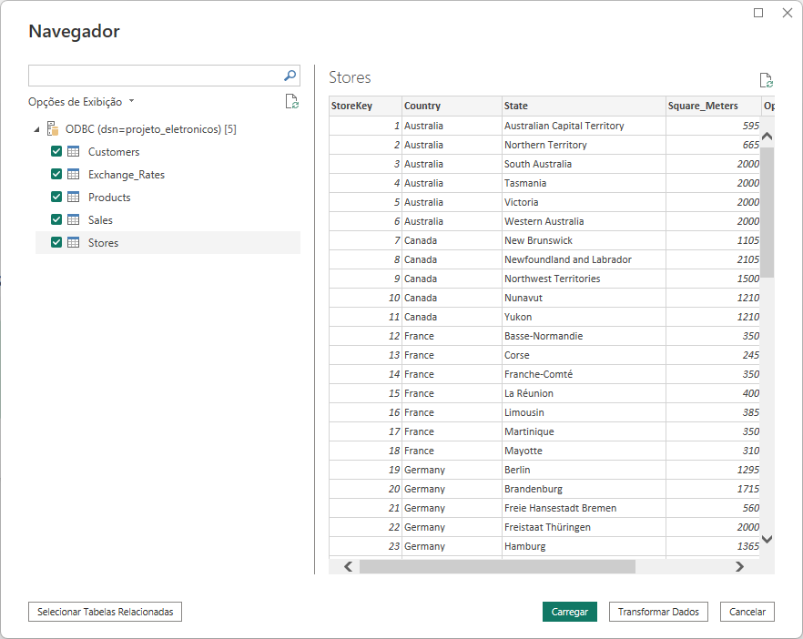
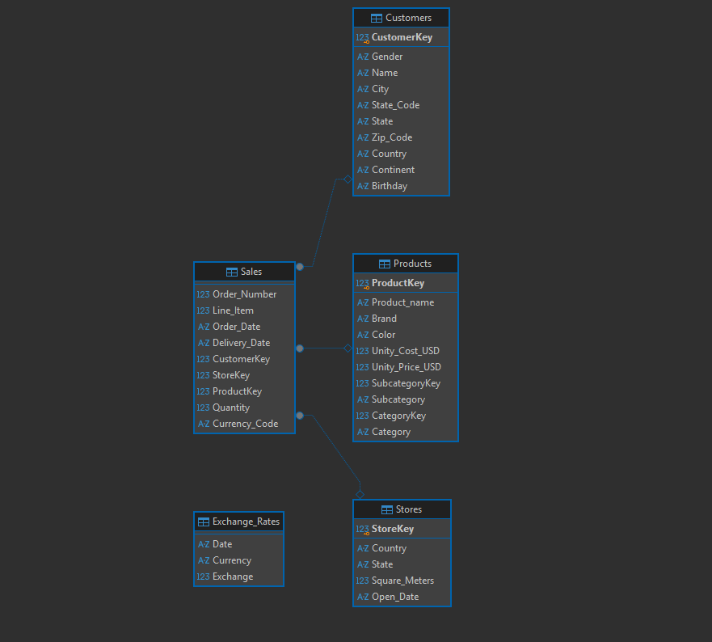
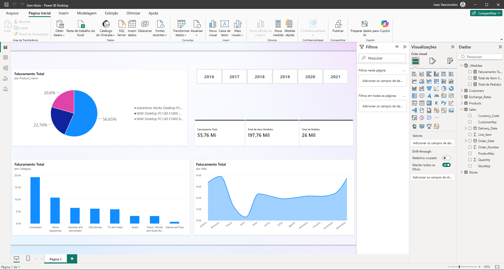

# Projeto de Vendas: SQL e Power BI

Oi, esse aqui é um projeto de dados que montei do zero para colocar em prática o que venho estudando sobre banco de dados e Power BI. 

A ideia foi simular um fluxo real de trabalho de acordo com minhas habilidades e conhecimentos: criei o banco de dados relacional, tratei os dados via SQL, conectei tudo no Power BI via ODBC e montei um dashboard interativo.

---

### 1. O Banco de Dados (SQLite + DBeaver)
Primeiro, organizei as pastas e criei as 5 tabelas no SQLite usando o DBeaver. Defini as chaves primárias e estrangeiras (`PRIMARY KEY` e `FOREIGN KEY`) para deixar as tabelas conectadas de forma correta.

---

### 2. Tratando os Dados com SQL
Antes de mandar tudo pro Power BI, notei que algumas células estavam sem valores atribuídos e consultei se os valores estavam listados como `NULL`, fiz umas correções na tabela de vendas e rodei alguns `JOIN`s pra testar se as tabelas estavam realmente conectadas.

---

### 3. Conectando no Power BI via ODBC
Em vez de só importar um arquivo CSV simples, configurei um driver ODBC pra puxar os dados direto do banco de dados pro Power BI Desktop.

---

### 4. Modelagem dos Dados (Star Schema)
Dentro do Power BI, organizei a tabela Fato (`Sales`) ligada com as tabelas Dimensão (`Customers`, `Products`, `Stores`) e também forem feitas correções relacionadas às colunas (`Unity_Cost_USD` e `Unity_Price_USD`). 

---

### 5. O Dashboard Final
Por fim, criei as métricas usando DAX (`Faturamento Total`, `Total de Pedidos`, etc.) e montei o visual com botões de filtro por ano (2016 a 2021), gráficos de top produtos e faturamento por categoria.

---

 **O que aprendi com esse projeto:**
* Criar e relacionar tabelas no SQL do zero.
* Conectar banco de dados no Power BI usando ODBC.
* Estruturar o modelo em Star Schema.
* Criar medidas em DAX e formatar o visual do dashboard de um jeito limpo.

Por ser meu primeiro projeto fique à vontade para mandar sugestões ou feedbacks para melhorar!

---

## Fonte dos Dados e Créditos
Os dados utilizados neste projeto foram obtidos a partir do repositório/dataset do **Kaggle** disponibilizado por **Bhavik Jikadara**. 
- **Dataset original:** https://www.kaggle.com/datasets/bhavikjikadara/global-electronics-retailers

*Agradecimentos ao criador por disponibilizar a base para fins de estudo e prática de análise de dados!*
